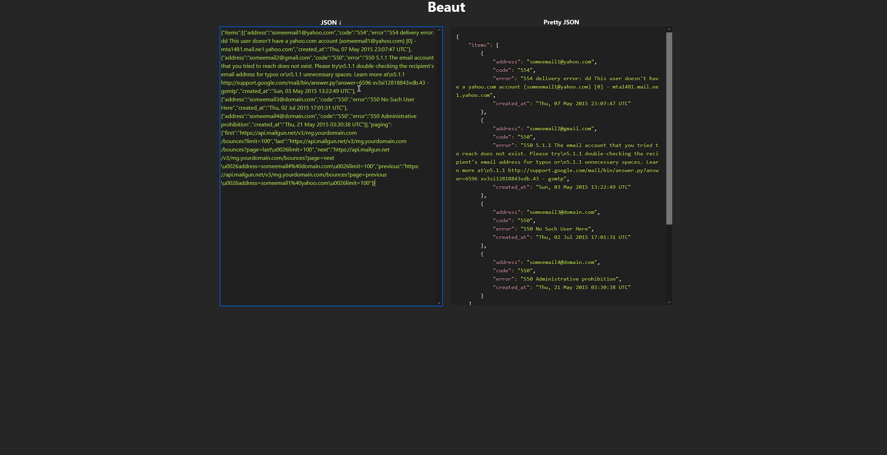
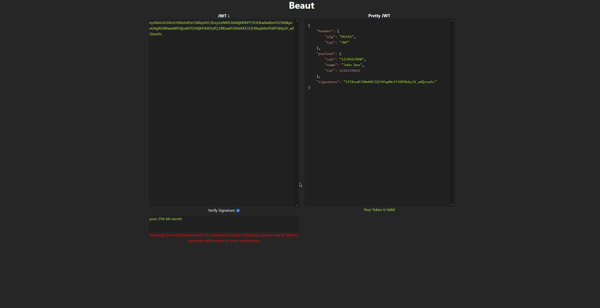

# Beaut
## React Web App for Beautifying JSON and JWTs

# Project Description:
This project uses ReactJS with Mobx for state management, as well as SASS and Bootstrap4 for design.

I also used [react-syntax-highlighter](https://github.com/react-syntax-highlighter/react-syntax-highlighter) component for syntax styling.

This project was a lot of fun as it solidified my understanding of JWTs and the encrypting/decrypting that goes into them. I decided to make this project after going through the process of OAuth with the Spotify API in my [SpotifyLEDDisplay](https://github.com/CJosephW/SpotifyLEDDisplay) project. I found myself constantly running into JWT verification errors and struggling to read some of the raw JSON. So I used this project to use as a tool as well as a learning experience to sharpen my knowledge on React and JWTs. This was also my first time using a state management library besides redux and I have to say I prefer MobX over the former as it's quicker to setup and seems to be easier to scale comparatively.

# Future Plans
1. Add more simple and quick tools such as base64 encoder/decoder
2. add more encryption formats as right now the JWT beautifyer only supports HS256 for signature verification

# Getting Setup
1. ``` git clone https://github.com/CJosephW/Beaut ```
2. ``` npm install ```
3. ``` npm start ```

if all goes well it should look something like this:

